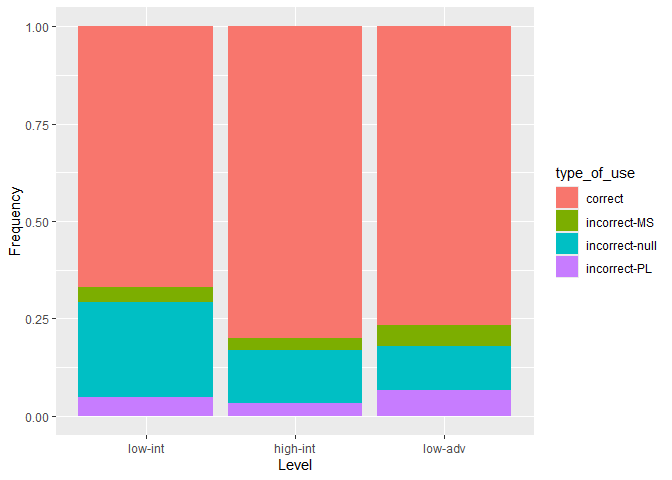
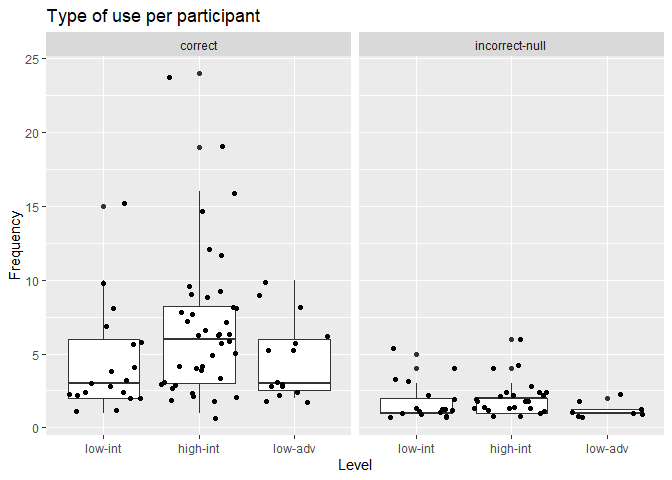
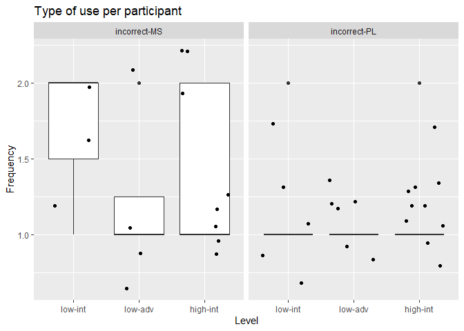

Corpus based analysis of indefinite article use by Saudi ESL learners:
evidence from spoken data
================
Abdulmajeed Alharbi
17 Dec 2024

- [Data pipeline](#data-pipeline)
  - [Filtering participants](#filtering-participants)
  - [Extracting variables for the
    data](#extracting-variables-for-the-data)
  - [Tagging the Transcripts](#tagging-the-transcripts)
  - [Extracting Tokens](#extracting-tokens)
  - [Analysis](#analysis)

# Data pipeline

- *Existing*

## Filtering participants

First, I need to make sure all the files are of L1 Arabic speakers. I am
not allowed to share the key referred to below, but I left these cells
since they are part of the process. The fist data frame that includes
id, levels, and transcripts has been saved and read into the object
`speechdf` on line 105. Feel free to jump ahead.

``` r
# read in the key which includes speakers' ids and L1s
id <- read_excel("Private/user_id-anon_id-key_EDITED.xlsm")
```

    ## Warning: Expecting numeric in A1315 / R1315C1: got 'tqn3"'

    ## Warning: Expecting numeric in B1315 / R1315C2: got 'Truong'

``` r
# only select the relevant columns
id <- id %>% 
  select(user_id, native_language)

# the lowest id value in TalkBank is 848 and the highest is 1351. This filters out participants who are not involved in the TalkBank data and only leaves the L1 Arabic.
Arbids <- id %>% 
  filter(user_id > 847, user_id < 1352, native_language == "Arabic")

# extract the ids as a pattern 
onlyarb <- str_extract(Arbids$user_id, "\\d{3,}")

# this is the file that includes the TalkBank transcripts
speech <- "data/Vercellotti"

# this reads all the file paths to an object from which I can filter non-Arabic L1s
speech <- list.files(speech, pattern = "*.cha", full.names = TRUE)

#  collapse the different strings (ids) into one string separated by | for matching
onlyarb <- str_flatten(onlyarb, "|")
 
# filter out non-Arabic L1s
speech <- str_subset(speech, onlyarb)
```

## Extracting variables for the data

I need to create a variable for participants’ ids, and a variable for
their level.

``` r
#this gives the ids listed in the file names
ids <- str_extract(speech, "\\d{3,}")

# this gives the level listed in the file names
levels <- str_extract(speech, "_\\d{1}[A-Z]")
levels <- str_remove_all(levels, "_|[A-Z]") 

# changing the names in level to something more meaningful
levels <- str_replace_all(levels, c("3" = "low-int", "4" = "high-int", "5" = "low-adv"))
```

Before I create the data frame, I need to remove the first few lines of
metadata in the transcripts

``` r
# read the lines 
lines <- map(speech, read_lines)

# put the maximum number of lines in an object
max <- map_int(lines, length) %>% max()

# this is mapping the rep function over every element in the list. The number of NAs added to each line is calculated by the max number of line - the number of lines of each element.
evenlines <- map(lines, ~c(.x, rep(NA, max - length(.x))))

# now that all the elements have even number of lines, I can put it in a tibble to use slice to remove lines I don't want. 
tibblelines <- as.data.frame(evenlines)

# this removes the first few lines. For some reason slice_tail selects from the start not the end, and slice_head selects from the end.
removedlines <- slice_tail(tibblelines, n = -9)


# save the sliced transcripts as a list in an object to put them in a tibble with ids and levels later.
removedlines <- as.list(removedlines)
```

cleaning the transcripts from CHAT formatting

``` r
clean <- removedlines %>% 
   str_remove_all("\\bNA\\b|\\d+_\\d+|\\*\\d+|\\d{3}|@...|\\\\t|\\\n|c\\(|[^.|^\\w|\\s]|\\buh\\s|\\bah\\s|\\bPAR|\\bPAR0") %>% 
  str_replace_all("_", " ")
```

    ## Warning in stri_replace_all_regex(string, pattern,
    ## fix_replacement(replacement), : argument is not an atomic vector; coercing

creating the data frame with participants’ IDs, proficiency level, and
the transcripts of their production

``` r
# create the data frame/tibble with ids, levels, and transcripts
speechdf <- tibble(ID = ids, Level = levels, Transcript = clean)


speechdf <- readRDS("data/speechdf.csv")
```

## Tagging the Transcripts

I will POS tag the data frames to make analyzing the contexts of article
use possible

``` r
library(udpipe)

# downloading the model only needs to be done once.
udpipe_download_model(language = "english-ewt")
```

    ## Downloading udpipe model from https://raw.githubusercontent.com/jwijffels/udpipe.models.ud.2.5/master/inst/udpipe-ud-2.5-191206/english-ewt-ud-2.5-191206.udpipe to C:/Users/Abdul/OneDrive/Desktop/Data Science/L1Arb-Eng-Articles-Analysis/english-ewt-ud-2.5-191206.udpipe

    ##  - This model has been trained on version 2.5 of data from https://universaldependencies.org

    ##  - The model is distributed under the CC-BY-SA-NC license: https://creativecommons.org/licenses/by-nc-sa/4.0

    ##  - Visit https://github.com/jwijffels/udpipe.models.ud.2.5 for model license details.

    ##  - For a list of all models and their licenses (most models you can download with this package have either a CC-BY-SA or a CC-BY-SA-NC license) read the documentation at ?udpipe_download_model. For building your own models: visit the documentation by typing vignette('udpipe-train', package = 'udpipe')

    ## Downloading finished, model stored at 'C:/Users/Abdul/OneDrive/Desktop/Data Science/L1Arb-Eng-Articles-Analysis/english-ewt-ud-2.5-191206.udpipe'

    ##      language
    ## 1 english-ewt
    ##                                                                                                  file_model
    ## 1 C:/Users/Abdul/OneDrive/Desktop/Data Science/L1Arb-Eng-Articles-Analysis/english-ewt-ud-2.5-191206.udpipe
    ##                                                                                                                                  url
    ## 1 https://raw.githubusercontent.com/jwijffels/udpipe.models.ud.2.5/master/inst/udpipe-ud-2.5-191206/english-ewt-ud-2.5-191206.udpipe
    ##   download_failed download_message
    ## 1           FALSE               OK

``` r
#loading the language model
model <- udpipe_load_model(file = ("english-ewt-ud-2.5-191206.udpipe"))
```

The POS tagger does not specify mass nouns, and distinguishing them from
singular count nouns is important for the analysis. Thus a list of mass
nouns was created to later tag the included nouns as mass:

``` r
massNN <- c("admiration/NNM", "advice/NNM", "air/NNM", "anger/NNM", "anticipation/NNM",
  "assistance/NNM", "awareness/NNM", "bacon/NNM", "baggage/NNM", "blood/NNM",
  "bravery/NNM", "chess/NNM", "clay/NNM", "clothing/NNM", "coal/NNM", "compliance/NNM",
  "comprehension/NNM", "confusion/NNM", "consciousness/NNM", "cream/NNM", "darkness/NNM",
  "diligence/NNM", "dust/NNM", "education/NNM", "empathy/NNM", "enthusiasm/NNM", "envy/NNM",
  "equality/NNM", "equipment/NNM", "evidence/NNM", "feedback/NNM", "fitness/NNM", "flattery/NNM",
  "foliage/NNM", "fun/NNM", "furniture/NNM", "garbage/NNM", "gold/NNM", "gossip/NNM",
  "grammar/NNM", "gratitude/NNM", "gravel/NNM", "guilt/NNM", "happiness/NNM", "hardware/NNM",
  "hate/NNM", "hay/NNM", "health/NNM", "heat/NNM", "help/NNM", "hesitation/NNM", "homework/NNM",
  "honesty/NNM", "honor/NNM", "hospitality/NNM", "hostility/NNM", "humanity/NNM", "humility/NNM",
  "ice/NNM", "immortality/NNM", "independence/NNM", "information/NNM", "integrity/NNM",
  "intimidation/NNM", "jargon/NNM", "jealousy/NNM", "jewelry/NNM", "justice/NNM", "knowledge/NNM",
  "literacy/NNM", "logic/NNM", "luck/NNM", "lumber/NNM", "luggage/NNM", "mail/NNM", "management/NNM",
  "merchandise/NNM", "milk/NNM", "morale/NNM", "mud/NNM", "music/NNM", "nonsense/NNM", "oppression/NNM",
  "optimism/NNM", "oxygen/NNM", "participation/NNM", "pay/NNM", "peace/NNM", "perseverance/NNM",
  "pessimism/NNM", "pneumonia/NNM", "poetry/NNM", "police/NNM", "pride/NNM", "privacy/NNM",
  "propaganda/NNM", "public/NNM", "punctuation/NNM", "recovery/NNM", "rice/NNM", "rust/NNM",
  "satisfaction/NNM", "shame/NNM", "sheep/NNM", "slang/NNM", "software/NNM", "spaghetti/NNM",
  "stamina/NNM", "starvation/NNM", "steam/NNM", "steel/NNM", "stuff/NNM", "support/NNM", "sweat/NNM",
  "thunder/NNM", "timber/NNM", "toil/NNM", "traffic/NNM", "training/NNM", "trash/NNM",
  "understanding/NNM", "valor/NNM", "vehemence/NNM", "violence/NNM", "warmth/NNM", "waste/NNM",
  "weather/NNM", "wheat/NNM", "wisdom/NNM", "work/NNM", "food/NNM", "ham/NNM", "beef/NNM", "lettuce/NNM", "tv/NNM", "money/NNM", "pollution/NNM", "oil/NNM", "bread/NNM", "pasta/NNM", "hair/NNM", "football/NNM", "soccer/NNM", "cheese/NNM", "english/NNM"  )
```

Here, the POS tagger is run on the transcripts. This creates an output
coercible into a tibble format that includes tokens and POS. This is put
in new column that that includes a tibble for each transcript. The
transcripts are then essentially recreated but with each token tagged.
The last part of the code replaces the POS tag of the matching words
from the mass noun list with a tag for mass nouns “NNM”.

``` r
# this is the pattern used to retag mass nouns 
patternn <- paste0("\\b(", paste(sub("/NNM", "", massNN), collapse = "|"), ")\\b/NN")


ANNOTspeechh <- speechdf %>%
  mutate(annoTXT = map(Transcript, ~ udpipe_annotate(model, .x) %>% as_tibble %>%   
                         mutate(annotTXT = paste(token, "/", xpos, collapse = " ", sep = "") %>% str_replace_all(patternn, "\\1/NNM"))))
```

Now that I have recreated the transcripts with POS tags, I will unnest
the columns from the tibbles and only keep the tagged transcripts from
that output.

``` r
ANNOTspeech <- ANNOTspeechh %>% 
  unnest(annoTXT) %>% 
  select(ID, Level, Transcript, annotTXT) %>% 
  distinct()
```

## Extracting Tokens

The next step is to extract the tokens of indefinite article use using
the tagged transcripts. But first, I must address how the incorrect-null
tokens will be extracted: The very long list of strings below (line
204-228) includes all the tokens that are appropriate for
incorrect-null. These were extracted by hand by going through the output
of the code in the next cell because I found no better way to get the
relevant tokens.

``` r
# I created a pattern to exclude so that I can focus on cases where indefinite articles were not used for incorrectNull.
# pattern1 <- "\\w+/(DT|CD)\\s(\\w+/\\w+\\s)?\\w+/NN\\s"
# pattern2 <- "\\w+/VB.\\s(\\w+/\\w+\\s)?(someone|something|somewhere|everything|everyone|anyone|anybody|anything|nothing|experience|worhis|forget|shopping|Weam|childhood)/NN\\s"
# ann <- ANNOTspeech %>% 
#   filter(Level == "low-adv") 
# ann$annotTXT %>%
#   str_split(pattern1) %>%
#   str_split(pattern2) %>% 
#   str_split("are/VBP") %>% 
#   str_remove_all("\\b../NN\\s") %>% 
#   str_remove_all("\\b./NN\\s|\\bwor") %>% 
#   str_remove_all("\\bPAR/NN|\\bPAR0/NN|\\bPAR0|\\bPAR1") %>% 
#   str_remove_all("um/NN|um/JJ") %>%
# str_extract_all("\\w+/\\w+\\s\\w+/VB.\\s(\\w+/\\w+\\s){0,2}\\w+/NN\\s")
```

These are split into two objects because R has a limit for how many
strings can be used in `str_c()`.

``` r
noart <- str_c("because/IN hes/VBZ intelligent/JJ man/NN ", "people/NNS use/VBP taxi/NN " , "it/PRP s/VBZ good/JJ transportation/NN " ,    
  "people/NNS use/VBP car/NN " , "he/PRP was/VBD child/NN " , "he/PRP was/VBD child/NN " , "he/PRP was/VBD child/NN " , "he/PRP was/VBD child/NN "  , "he/PRP has/VBZ hes/NNS challenge/NN ", "and/CC need/VBP cup/NN " , "I/PRP take/VBP assist/NN ", "there/EX is/VBZ fewer/JJR pollution/NN " ,    
 "we/PRP have/VBP tomato/NN " ,                  "is/VBZ egg/VBG with/IN cheese/NN ",            "which/WDT is/VBZ oil/NN wil/NN " ,            
 "we/PRP put/VBD it/PRP oil/NN "  ,              "is/VBZ is/VBZ little/JJ bit/NN ",              "is/VBZ is/VBZ little/JJ bit/NN ",             
 "food/NNCC was/VBD s/POS cheese/NN " ,          "is/VBZ made/VBN from/IN bread/NN ",            "in/IN cutting/VBG cheese/NN " ,               
 "he/PRP is/VBZ studying/VBG english/NN ",       "child/NN was/VBD um/JJ pasta/NN ",             "I/PRP want/VBP eat/JJ pasta/NN ",             
 "they/PRP have/VBP good/JJ economy/NN ",        "I/PRP was/VBD child/NN ",                      "ah/RB hes/VBZ old/JJ friend/NN ",             
 "she/PRP has/VBZ black/JJ hair/NN ",            "it/PRP was/VBD normal/JJ day/NN " ,            "he/PRP has/VBZ sense/NN ",                    
 "usually/RB go/VBP in/IN picnic/NN ",           "this/DT is/VBZ significant/JJ day/NN ",        "he/PRP was/VBD wants/VBZ device/NN ",         
 "I/PRP want/VBP device/NN ",                    "we/PRP played/VBD soccer/NN ",                 "female/JJ played/VBN soccer/NN ",             
 "was/VBD playing/VBG playing/VBG football/NN ", "you/PRP played/VBD football/NN ",              "I/PRP played/VBD football/NN ",               
 "it/PRP s/VBZ first/JJ time/NN ",               "I/PRP was/VBD child/NN " ,                     "that/WDT was/VBD abnormal/JJ thing/NN ",      
 "this/DT is/VBZ bad/JJ surprise/NN "  ,         "I/PRP went/VBD to/IN university/NN " ,         "she/PRP have/VBP similar/JJ way/NN " ,        
 "it/PRP was/VBD normal/JJ day/NN "  ,           "we/PRP spend/VBP great/JJ time/NN " ,          "we/PRP played/VBD soccer/NN moradvtem/NN "  , 
 "we/PRP went/VBD to/IN market/NN " ,            "Ali/NNP is/VBZ good/JJ friend/NN ",            "Ali/NNP is/VBZ good/JJ friend/NN " ,          
 "he/PRP has/VBZ requality/NN quality/NN ",      "I/PRP saw/VBD snake/NN ",                      "I/PRP saw/VBD snake/NN ",                     
 "I/PRP saw/VBD snake/NN worbut/NN ",            "I/PRP saw/VBD snake/NN ",                      "I/PRP saw/VBD fn/JJ snake/NN ",               
 "I/PRP saw/VBD fn/JJ snake/NN ", "that/IN causing/VBG problem/NN ", "I/PRP have/VBP vacation/NN ", "it/PRP s/VBZ small/JJ city/NN ",  "renting/VBG rent/JJ apartment/NN ", "that/WDT s/VBZ difference/NN ",  "I/PRP think/VBP it/PRP s/VBZ fish/NN ",  "that/WDT s/VBZ custom/JJ and/NN ", "I/PRP was/VBD graduate/NN ", "we/PRP need/VBP job/NN ", "it/PRP s/VBZ very/RB beautiful/JJ university/NN ", "it/PRP s/VBZ high/JJ cost/NN ", "I/PRP love/VBP wedding/NN party/NN ", "it/PRP is/VBZ big/JJ city/NN ", "I/NNS come/VBP from/IN real/JJ city/NN ", "there/EX is/VBZ far/JJ farm/NN ", "that/DT s/VBZ bad/JJ behavior/NN ", "he/PRP was/VBD talk/VB with/IN bird/NN ", "it/PRP is/VBZ small/JJ city/NN ", "be/VB becoming/VBG more/JJR clear/JJ idea/NN ", "who/WP went/VBD to/IN marriage/NN ", "also/RB have/VBP extra/JJ separation/NN ", "it/PRP is/VBZ like/IN custom/NN ", "so/NN hes/VBZ very/RB famous/JJ person/NN ", "and/CC look/VBP quiet/JJ city/NN ", "who/WP needs/VBZ operation/NN ", "it/PRP was/VBD um/RB interesting/JJ job/NN ", sep = "|") %>% str_replace_all(" ", "\\\\s")

 noart2<- str_c("country/NN faces/VBZ sometimes/RB chronic/JJ disease/NN ", "he/PRP was/VBD inspiration/NN ", "they/PRP get/VBP boy/NN ", "it/PRP has/VBZ really/RB nice/JJ view/NN ",  "Arabia/NNP renting/VBG apartment/NN ", "they/PRP do/VBP nt/RB have/VB job/NN ",  "become/VBP better/JJR person/NN ", "he/PRP is/VBZ very/RB good/JJ person/NN ", "and/CC have/VBP picnic/NN ", "usually/RB have/VBP picnic/NN ", "that/WDT made/VBD him/PRP famous/JJ person/NN ", "I/PRP come/VBP from/IN real/JJ city/NN ", "I/PRP live/VBP in/IN small/JJ town/NN ",  "is/VBZ bad/JJ behavior/NN ",  "city/NN is/VBZ coastal/JJ city/NN ", "it/PRP s/VBZ castle/NN city/NN ", "it/PRP is/VBZ small/JJ small/JJ city/NN ", "I/PRP graduate/VBP from/IN bachelor/NN degree/NN ", "it/PRP was/VBD girl/NN ", "he/PRP was/VBD very/RB famous/JJ person/NN ", "is/VBZ is/VBZ not/RB good/JJ way/NN ", "it/PRP is/VBZ nice/JJ job/NN ", "he/PRP is/VBZ also/RB old/JJ man/NN ", "they/PRP get/VBP girl/NN ", "it/PRP s/VBZ look/VB like/IN circle/NN ", "who/WP was/VBD prince/NN ", "it/PRP s/VBZ really/RB big/JJ city/NN ", "that/IN causing/VBG problem/NN ", "I/PRP have/VBP vacation/NN ", "it/PRP s/VBZ small/JJ city/NN ",  "renting/VBG rent/JJ apartment/NN ", "that/WDT s/VBZ difference/NN ",  "I/PRP think/VBP it/PRP s/VBZ fish/NN ",  "that/WDT s/VBZ custom/JJ and/NN ", "I/PRP was/VBD graduate/NN ", "we/PRP need/VBP job/NN ", "it/PRP s/VBZ very/RB beautiful/JJ university/NN ", "it/PRP s/VBZ high/JJ cost/NN ", "I/PRP love/VBP wedding/NN party/NN ", "it/PRP is/VBZ big/JJ city/NN ", "I/NNS come/VBP from/IN real/JJ city/NN ", "there/EX is/VBZ far/JJ farm/NN ", "that/DT s/VBZ bad/JJ behavior/NN ", "he/PRP was/VBD talk/VB with/IN bird/NN ", "it/PRP is/VBZ small/JJ city/NN ", "be/VB becoming/VBG more/JJR clear/JJ idea/NN ", "who/WP went/VBD to/IN marriage/NN ", "also/RB have/VBP extra/JJ separation/NN ", "it/PRP is/VBZ like/IN custom/NN ", "so/NN hes/VBZ very/RB famous/JJ person/NN ", "and/CC look/VBP quiet/JJ city/NN ", "who/WP needs/VBZ operation/NN ", "it/PRP was/VBD um/RB interesting/JJ job/NN ", "country/NN faces/VBZ sometimes/RB chronic/JJ disease/NN ", "he/PRP was/VBD inspiration/NN ", "they/PRP get/VBP boy/NN ", "it/PRP has/VBZ really/RB nice/JJ view/NN ",  "Arabia/NNP renting/VBG apartment/NN ", "they/PRP do/VBP nt/RB have/VB job/NN ",  "become/VBP better/JJR person/NN ", "he/PRP is/VBZ very/RB good/JJ person/NN ", "and/CC have/VBP picnic/NN ", "usually/RB have/VBP picnic/NN ", "that/WDT made/VBD him/PRP famous/JJ person/NN ", "I/PRP come/VBP from/IN real/JJ city/NN ", "I/PRP live/VBP in/IN small/JJ town/NN ",  "is/VBZ bad/JJ behavior/NN ",  "city/NN is/VBZ coastal/JJ city/NN ", "it/PRP s/VBZ castle/NN city/NN ", "it/PRP is/VBZ small/JJ small/JJ city/NN ", "I/PRP graduate/VBP from/IN bachelor/NN degree/NN ", "it/PRP was/VBD girl/NN ", "he/PRP was/VBD very/RB famous/JJ person/NN ", "is/VBZ is/VBZ not/RB good/JJ way/NN ", "it/PRP is/VBZ nice/JJ job/NN ", "he/PRP is/VBZ also/RB old/JJ man/NN ", "they/PRP get/VBP girl/NN ", "it/PRP s/VBZ look/VB like/IN circle/NN ", "who/WP was/VBD prince/NN ", "it/PRP s/VBZ really/RB big/JJ city/NN ", "which/WDT is/VBZ virus/NN antivirus/JJ program/NN ", "by/IN using/VBG protect/JJ protect/NN program/NN ", "of/IN living/VBG in/IN computer/NN society/NN ", "with/IN swimming/VBG pool/NN ", "of/IN using/VBG computer/NN ", "people/NNS have/VBP real/JJ problem/NN ", "it/PRP s/VBZ good/JJ thing/NN ", "they/PRP live/VBP unhealthy/JJ life/NN ", "that/DT is/VBZ that/IN is/VBZ risk/NN ", "they/PRP use/VBP firewall/NN ", "they/PRP use/VBP new/JJ way/NN ", sep = "|" ) %>% 
  str_replace_all(" ", "\\\\s")
```

Here, the tokens of article use are extracted. `incorrectNull` and
`incorrectNull1` extract the same contexts, but since the pattern is
split into two objects I extracted them separately first.

``` r
ANNOTspeech <- ANNOTspeech %>% 
  mutate(correct = ANNOTspeech$annotTXT %>% 
  str_remove_all("\\b../NN\\s") %>% 
  str_remove_all("\\b./NN\\s") %>% 
  str_remove_all("a/DT\\screating/NN\\s|a/DT\\smam/NN\\s|a/DT\\sfewer/JJR\\sgarage/NN\\s|a/DT\\sthe/DT\\stopic/NN\\s|a/DT\\sfewer/JJR\\sparking/NN\\s|a/DT\\slot/NN") %>% 
  str_remove_all("pollution|a/DT\\smany/JJ\\sfuture/NN|a/DT\\smissing/NN|a/DT\\sskin/NN\\scancer/NN|a/DT\\slil/NN|a/DT\\sArab/JJ\\sGulf/NN|a/DT\\sgood/JJ\\sethics/NN|a/DT\\stha/NN|an/DT\\sd/JJ\\smoreover/NN|a/DT\\swalking/NN|a/DT\\smoney/NN") %>% 
  str_remove_all("a/DT\\senter/NN|a/DT\\skra/NN|a/DT\\smoney/NN|a/DT\\scensorshi/NN\\scen/NN|a/DT\\scompassion/NN|a/DT\\sligstory/NN\\sluxury/NN ") %>% 
  str_remove_all("\\bPAR/NN|\\bPAR0/NN|\\bPAR0") %>%
  str_extract_all("(a|an)/DT\\s(\\w+/\\w+\\s)?\\w+/NN\\s"),
  
  incorrectPL =  ANNOTspeech$annotTXT %>%
  str_remove_all("\\b../NN") %>% 
  str_remove_all("\\b./NN\\s") %>% 
  str_remove_all("a/DT\\sfew/JJ\\sbuses/NNS") %>%
  str_remove_all("a/DT\\scouple/NN\\syears/NNS") %>% 
  str_remove_all("a/DT\\sfew/JJ\\sscenes/NNS|a/DT\\sfew/JJ\\smovies/NNS") %>%
  str_extract_all("(a|an)/DT\\s(\\w+/\\w+\\s)?\\w+/NNS"),
  
  incorrectMS = ANNOTspeech$annotTXT %>%
  str_remove_all("\\b../NN") %>% 
  str_remove_all("\\b./NN\\s") %>% 
  str_remove_all("a/DT\\swhole/JJ\\ssheep/NNC") %>%
  str_extract_all("(a|an)/DT\\s(\\w+/\\w+\\s)?\\w+/NNM"),
  
  incorrectNull =  ANNOTspeech$annotTXT %>%
  str_extract_all(noart),
 
  
  incorrectNull1 =  ANNOTspeech$annotTXT %>%
  str_extract_all(noart2))
```

The next step is to pivot the data longer by putting the names of the
columns of the extracted context as ‘type_of_use’ and the contexts of
article use into ‘context_of_use’. This is followed by renaming
`incorrectNull1` as `incorrectNull`.

``` r
ANNOTspeech <- ANNOTspeech %>% 
  pivot_longer(c(correct, incorrectPL, incorrectMS, incorrectNull, incorrectNull1), names_to = "type_of_use", values_to = "contexts_of_use") %>% 
  unnest(contexts_of_use) %>% distinct()

# renaming incorrectNull1 and incorrectNull as incorrect-null. The same is done for incorrectPL and incorrectMS.
ANNOTspeech$type_of_use<- ANNOTspeech$type_of_use %>% 
  str_replace_all("incorrectNull1", "incorrect-null") %>% 
  str_replace_all("incorrectNull", "incorrect-null") %>% 
  str_replace_all("incorrectPL", "incorrect-PL") %>% 
  str_replace_all("incorrectMS", "incorrect-MS")

# moving the new columns to the front
ANNOTspeech <- relocate(ANNOTspeech, type_of_use, contexts_of_use, .after = Level) 

# removing any duplicate observations. 
ANNOTspeech <- distinct(ANNOTspeech)
```

## Analysis

For this project the main goal is to see how many times the participants
used articles, correctly or incorrectly, vs omitted them from obligatory
contexts. To this end, a count of instances will be used as well as
visualizations.

``` r
# a plot showing the proportion of difference of each type of use per level
ANNOTspeech %>% 
  ggplot(aes(as_factor(Level), fill = type_of_use))+
  geom_bar(position = "fill")+
  labs(x = "Level", y = "Frequency")
```

<!-- -->

the frequency in a table form for further clarity.

``` r
table(ANNOTspeech$Level, ANNOTspeech$type_of_use)
```

    ##           
    ##            correct incorrect-MS incorrect-null incorrect-PL
    ##   high-int     276           11             47           11
    ##   low-adv       69            5             10            6
    ##   low-int       83            5             30            6

ensuring that the token contributions from participants in each level
are fairly even

``` r
# ensuring that a single participant did not produce most or all of the tokens in correct and incorrect-null
   ANNOTspeech %>% 
  filter(type_of_use == "correct"|type_of_use == "incorrect-null") %>% 
  count(as_factor(Level), type_of_use, ID)  %>% 
    rename(Level = "as_factor(Level)") %>% 
    ggplot(aes(Level, n))+
    geom_boxplot() +
    geom_jitter()+
    facet_wrap(~ type_of_use)+
    labs(title = "Type of use per participant", y = "Frequency")
```

<!-- -->

``` r
# ensuring that a single participant did not produce most or all of the tokens in incorrect-PL and incorrect-MS
   ANNOTspeech %>% 
  filter(type_of_use == "incorrect-PL"|type_of_use == "incorrect-MS") %>%
  count(as_factor(Level), type_of_use, ID)  %>% 
  rename(Level = "as_factor(Level)") %>%
    ggplot(aes(Level, n))+
    geom_boxplot() +
    geom_jitter()+
    facet_wrap(~ type_of_use)+
    labs(title = "Type of use per participant", y = "Frequency")
```

<!-- -->

``` r
sessionInfo()
```

    ## R version 4.4.1 (2024-06-14 ucrt)
    ## Platform: x86_64-w64-mingw32/x64
    ## Running under: Windows 11 x64 (build 22631)
    ## 
    ## Matrix products: default
    ## 
    ## 
    ## locale:
    ## [1] LC_COLLATE=English_United States.utf8 
    ## [2] LC_CTYPE=English_United States.utf8   
    ## [3] LC_MONETARY=English_United States.utf8
    ## [4] LC_NUMERIC=C                          
    ## [5] LC_TIME=English_United States.utf8    
    ## 
    ## time zone: America/New_York
    ## tzcode source: internal
    ## 
    ## attached base packages:
    ## [1] stats     graphics  grDevices utils     datasets  methods   base     
    ## 
    ## other attached packages:
    ##  [1] udpipe_0.8.11   readxl_1.4.3    lubridate_1.9.3 forcats_1.0.0  
    ##  [5] stringr_1.5.1   dplyr_1.1.4     purrr_1.0.2     readr_2.1.5    
    ##  [9] tidyr_1.3.1     tibble_3.2.1    ggplot2_3.5.1   tidyverse_2.0.0
    ## 
    ## loaded via a namespace (and not attached):
    ##  [1] utf8_1.2.4        generics_0.1.3    stringi_1.8.4     lattice_0.22-6   
    ##  [5] hms_1.1.3         digest_0.6.37     magrittr_2.0.3    evaluate_0.24.0  
    ##  [9] grid_4.4.1        timechange_0.3.0  fastmap_1.2.0     cellranger_1.1.0 
    ## [13] Matrix_1.7-0      fansi_1.0.6       scales_1.3.0      cli_3.6.3        
    ## [17] rlang_1.1.4       crayon_1.5.3      bit64_4.0.5       munsell_0.5.1    
    ## [21] withr_3.0.1       yaml_2.3.10       tools_4.4.1       parallel_4.4.1   
    ## [25] tzdb_0.4.0        colorspace_2.1-1  vctrs_0.6.5       R6_2.5.1         
    ## [29] lifecycle_1.0.4   bit_4.0.5         vroom_1.6.5       pkgconfig_2.0.3  
    ## [33] pillar_1.9.0      gtable_0.3.5      data.table_1.16.0 Rcpp_1.0.13      
    ## [37] glue_1.7.0        highr_0.11        xfun_0.47         tidyselect_1.2.1 
    ## [41] rstudioapi_0.16.0 knitr_1.48        farver_2.1.2      htmltools_0.5.8.1
    ## [45] labeling_0.4.3    rmarkdown_2.28    compiler_4.4.1
